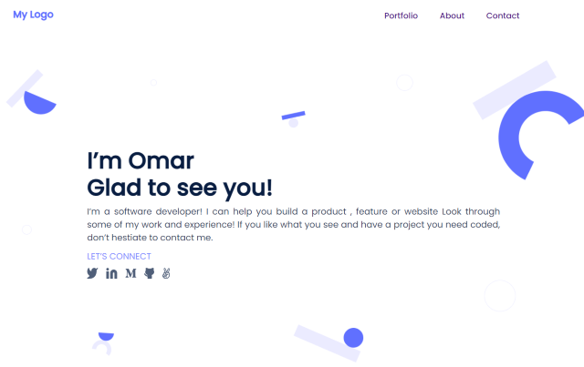

# My Portfolio Project

> This website to show all my projects, and it is my gallary to show my projects.



Main features of the project:

- Navbar
- Headline section
- My works section
- About section
- Contact Me
- Send contact info by using Formspree service.
- Responsive to all screen
- Have good accessibility
- Has google analytics
- Mobile menu navigations


## Built With

- Major languages 
  ```bash
  - (HTML, CSS, JavaScript)
  ```
  
  - Technologies/ Tools used 
  
  ``` bash
  - Git(version control)
  - LocalStorage
  - Linters
  ```
## Live Demo

[Live Demo Link](https://omarsalem7.github.io/Portfolio/)


## Getting Started
To get a local copy up and running follow these simple example steps.

### Prerequisites
 - A text editor(preferably Visual Studio Code)

### Install
  -  [Git](https://git-scm.com/downloads)
 
### Usage
#### Clone this repository

```bash
$ git clone https://github.com/omarsalem7/Portfolio.git
$ cd Portfolio 
```
#### Run project

```bash
- Open index.html in browser
```


## Authors

👤 **Omar Salem**

- GitHub: [Omar Salem](https://github.com/omarsalem7)
- Twitter: [Omar Salem](https://twitter.com/Omar80491499)
- LinkedIn: [Omar Salem](https://www.linkedin.com/in/omar-salem-a6945b177/)


## Show your support

Give a ⭐️ if you like this project!


## 📝 License

This project is [MIT](./MIT.md) licensed.
