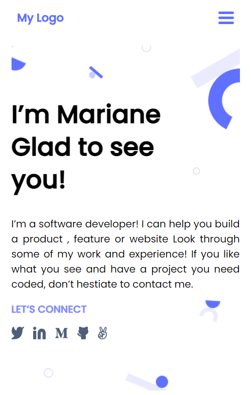
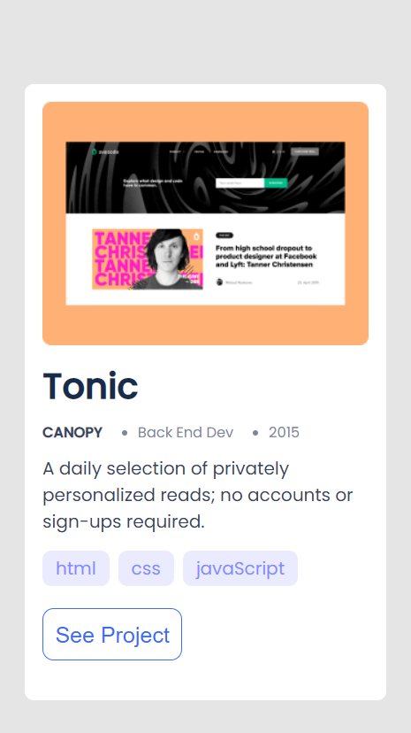
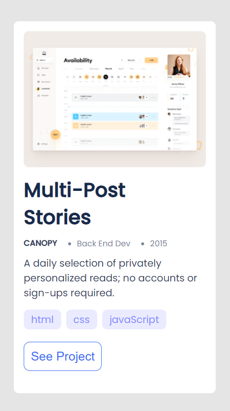
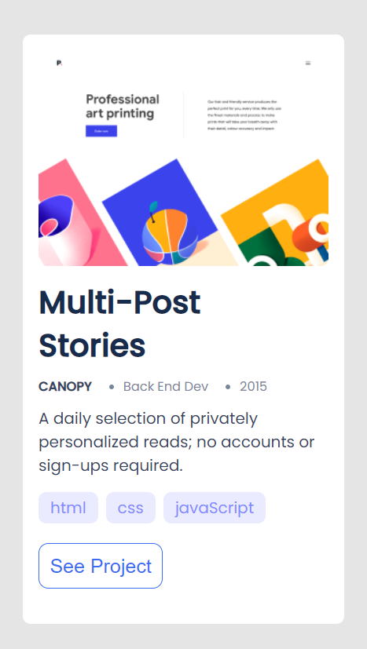
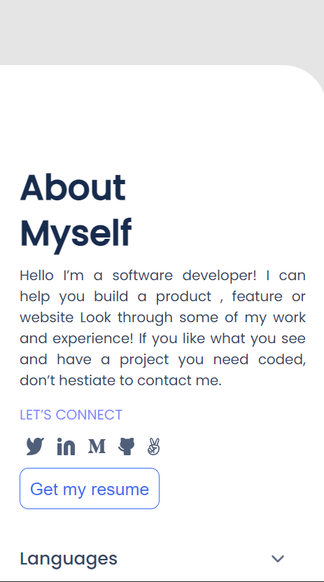
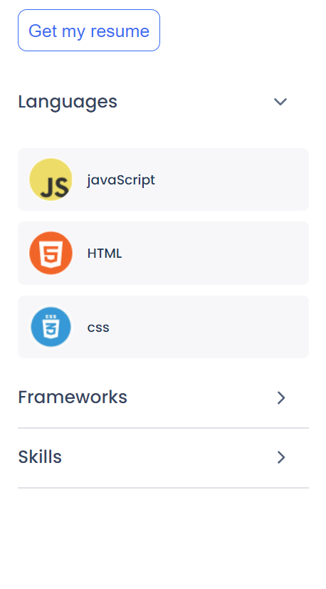
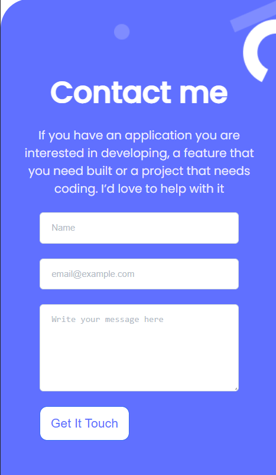

# My Portfolio Project

> This website to show all my projects, and it is my gallary to show my projects.

Main features of the project:

- Navbar
- headline section
- My works section
- About section
- Contact Me
- Send contact info by using Formspree service.
- Responsive to all screen

## Built With

- Html
- Css3

## Live Demo

[Live Demo Link](https://omarsalem7.github.io/Portfolio/)

## Authors

👤 **Omar Salem**

- GitHub: [@githubhandle](https://github.com/omarsalem7)
- Twitter: [@twitterhandle](https://twitter.com/Omar80491499)
- LinkedIn: [LinkedIn](https://www.linkedin.com/in/omar-salem-a6945b177/)

## Show your support

Give a ⭐️ if you like this project!

- Thanks for Microverse for this opportunity.

## 📝 License

This project is [MIT](./MIT.md) licensed.
